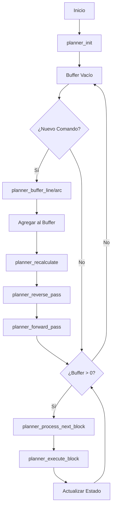

# Motion Planner - Documentación Técnica Detallada

## 📋 Índice
1. [Introducción](#introducción)
2. [Arquitectura General](#arquitectura-general)
3. [Estructuras de Datos](#estructuras-de-datos)
4. [Variables Globales](#variables-globales)
5. [Algoritmo Lookahead](#algoritmo-lookahead)
6. [Funciones Públicas](#funciones-públicas)
7. [Funciones Privadas](#funciones-privadas)
8. [Matemáticas del Junction Velocity](#matemáticas-del-junction-velocity)
9. [Flujo de Ejecución](#flujo-de-ejecución)
10. [Parámetros de Configuración](#parámetros-de-configuración)
11. [Casos de Uso](#casos-de-uso)
12. [Optimizaciones y Consideraciones](#optimizaciones-y-consideraciones)

---

## 🎯 Introducción

El **Motion Planner** es el núcleo inteligente del controlador CNC que implementa un algoritmo de **lookahead** para optimizar los movimientos. Su objetivo principal es generar trayectorias suaves y eficientes mediante la planificación anticipada de múltiples segmentos de movimiento.

### Características Principales:
- **Buffer circular** de 8 bloques para lookahead
- **Optimización de velocidades** en juntas entre segmentos
- **Soporte completo** para G0, G1, G2, G3
- **Algoritmo trapezoidal** para aceleración/desaceleración
- **Cálculo matemático** de velocidades de junta seguras
- **Gestión inteligente** de arcos con modos R e I,J

---

## 🏗️ Arquitectura General

```
┌─────────────────┐    ┌──────────────────┐    ┌─────────────────┐
│   G-Code        │───▶│  Motion Planner  │───▶│  Motion Control │
│   Commands      │    │                  │    │   Execution     │
└─────────────────┘    └──────────────────┘    └─────────────────┘
                              │
                              ▼
                       ┌──────────────┐
                       │ Lookahead    │
                       │ Algorithm    │
                       └──────────────┘
```

### Flujo de Datos:
1. **Entrada**: Comandos G-Code parseados (G0, G1, G2, G3)
2. **Procesamiento**: Buffer circular con algoritmo lookahead
3. **Optimización**: Cálculo de velocidades de junta y perfiles trapezoidales
4. **Salida**: Comandos optimizados para el sistema de motion

---

## 📊 Estructuras de Datos

### planner_block_t
Representa un único movimiento en el buffer:

```c
typedef struct {
    // Identificación del movimiento
    move_type_t move_type;          // RAPID, LINEAR, ARC_CW, ARC_CCW
    
    // Geometría del movimiento
    float start_pos[3];             // [X, Y, Z] posición inicial (mm)
    float target_pos[3];            // [X, Y, Z] posición objetivo (mm)
    float distance;                 // Distancia total del movimiento (mm)
    
    // Parámetros específicos para arcos
    float arc_center[2];            // [I, J] centro del arco (solo X,Y)
    float arc_radius;               // Radio del arco (mm)
    bool arc_radius_mode;           // true=modo R, false=modo I,J
    
    // Control de velocidades
    float nominal_speed;            // Velocidad solicitada (mm/min)
    float entry_speed;              // Velocidad calculada de entrada (mm/min)
    float exit_speed;               // Velocidad calculada de salida (mm/min)
    float max_entry_speed;          // Velocidad máxima permitida en entrada
    float acceleration;             // Aceleración aplicable (mm/min²)
    
    // Flags de estado y control
    bool busy;                      // true si el bloque está en uso
    bool executed;                  // true si ya fue ejecutado
    bool recalculate_flag;          // true si necesita recálculo
    bool nominal_length_flag;       // true si puede alcanzar velocidad nominal
} planner_block_t;
```

### planner_state_t
Estado global del planner:

```c
typedef struct {
    float position[3];              // Posición actual del planner (mm)
    float previous_speed[3];        // Velocidad previa por eje
    float previous_unit_vec[3];     // Vector unitario previo
    bool is_running;                // true si está ejecutando
    bool buffer_full;               // true si el buffer está lleno
    uint32_t total_blocks_processed; // Contador de bloques procesados
} planner_state_t;
```

---

## 🌐 Variables Globales

```c
// Buffer circular principal
planner_block_t planner_buffer[PLANNER_BUFFER_SIZE];

// Índices del buffer circular
volatile uint8_t planner_buffer_head = 0;    // Índice de escritura
volatile uint8_t planner_buffer_tail = 0;    // Índice de lectura  
volatile uint8_t planner_buffer_count = 0;   // Número de bloques activos

// Estado global del sistema
planner_state_t planner_state;
```

### Gestión del Buffer Circular:
- **head**: Apunta donde se agregará el próximo bloque
- **tail**: Apunta al próximo bloque a ejecutar
- **count**: Número total de bloques pendientes
- **PLANNER_BUFFER_SIZE**: 8 bloques (configurable)

---

## 🔍 Algoritmo Lookahead

El algoritmo lookahead es el corazón del planner. Optimiza velocidades analizando múltiples movimientos futuros simultáneamente.

### Fases del Algoritmo:

#### 1. **Reverse Pass (Paso hacia Atrás)**
```c
static void planner_reverse_pass(void)
```

**Objetivo**: Propagar limitaciones de velocidad desde el final hacia el inicio del buffer.

**Lógica de Programación**:
```c
// Empezar desde el último bloque agregado
uint8_t block_index = planner_buffer_head;
if (planner_buffer_count > 0) {
    block_index = planner_prev_block_index(block_index);
}

planner_block_t *block[3] = {NULL, NULL, NULL};

// Iterar hacia atrás por el buffer
while (block_index != planner_buffer_tail) {
    // Ventana deslizante de 3 bloques
    block[2] = block[1];    // Bloque más lejano
    block[1] = block[0];    // Bloque actual
    block[0] = &planner_buffer[block_index]; // Bloque nuevo
    
    if (block[1] != NULL && block[1]->recalculate_flag) {
        // Calcular velocidad segura para la junta
        float junction_speed = 0.0f;
        
        if (block[2] != NULL) {
            junction_speed = planner_junction_velocity(block[1], block[2]);
        }
        
        // Aplicar limitación si es más restrictiva
        if (junction_speed < block[1]->exit_speed) {
            block[1]->exit_speed = junction_speed;
            block[1]->recalculate_flag = false;
        }
    }
    
    block_index = planner_prev_block_index(block_index);
}
```

**¿Por qué hacia atrás?**
- Las limitaciones de velocidad se propagan mejor desde el final
- Permite identificar restricciones que afectan bloques anteriores
- Establece velocidades de salida seguras para cada bloque

#### 2. **Forward Pass (Paso hacia Adelante)**
```c
static void planner_forward_pass(void)
```

**Objetivo**: Calcular velocidades máximas alcanzables y generar perfiles trapezoidales.

**Lógica de Programación**:
```c
uint8_t block_index = planner_buffer_tail;
planner_block_t *block[2] = {NULL, NULL};

// Iterar hacia adelante por el buffer
while (block_index != planner_buffer_head) {
    block[0] = block[1];    // Bloque anterior
    block[1] = &planner_buffer[block_index]; // Bloque actual
    
    if (block[0] != NULL) {
        // Calcular velocidad máxima físicamente alcanzable
        float max_entry_speed = planner_max_allowable_speed(
            block[1]->acceleration, 
            block[0]->exit_speed, 
            block[1]->distance
        );
        
        // Aplicar limitación física
        if (block[1]->entry_speed > max_entry_speed) {
            block[1]->entry_speed = max_entry_speed;
        }
        
        // Generar perfil trapezoidal
        float entry_factor = block[1]->entry_speed / block[1]->nominal_speed;
        float exit_factor = block[1]->exit_speed / block[1]->nominal_speed;
        planner_calculate_trapezoid(block[1], entry_factor, exit_factor);
    }
    
    block_index = planner_next_block_index(block_index);
}
```

**¿Por qué hacia adelante?**
- Las limitaciones físicas se propagan mejor desde el inicio
- Permite calcular qué velocidad es realmente alcanzable
- Genera los perfiles de velocidad finales

---

## 🔧 Funciones Públicas

### void planner_init(void)

**Propósito**: Inicializar completamente el sistema del planner.

**Lógica de Programación**:
```c
void planner_init(void) {
    // 1. Limpiar buffer completamente
    memset(planner_buffer, 0, sizeof(planner_buffer));
    
    // 2. Resetear índices del buffer circular
    planner_buffer_head = 0;
    planner_buffer_tail = 0;
    planner_buffer_count = 0;
    
    // 3. Inicializar estado del planner
    memset(&planner_state, 0, sizeof(planner_state));
    planner_state.is_running = false;
    planner_state.buffer_full = false;
    planner_state.total_blocks_processed = 0;
    
    // 4. Sincronizar con la posición actual del hardware
    float current_pos[3];
    getCurrentPositionMM(&current_pos[0], &current_pos[1], &current_pos[2]);
    planner_set_current_position(current_pos);
}
```

**Consideraciones**:
- Sincronización con hardware es crítica
- Buffer debe estar completamente limpio
- Estado debe ser consistente

### bool planner_buffer_line(float target[3], float feed_rate, bool is_rapid)

**Propósito**: Agregar un movimiento lineal (G0/G1) al buffer del planner.

**Lógica de Programación**:
```c
bool planner_buffer_line(float target[3], float feed_rate, bool is_rapid) {
    // 1. Verificar disponibilidad de espacio
    if (planner_buffer_count >= PLANNER_BUFFER_SIZE) {
        planner_state.buffer_full = true;
        return false; // Buffer lleno, no se puede agregar
    }
    
    // 2. Obtener bloque libre en la cabeza del buffer
    planner_block_t *block = &planner_buffer[planner_buffer_head];
    
    // 3. Configurar tipo de movimiento
    block->move_type = is_rapid ? MOVE_TYPE_RAPID : MOVE_TYPE_LINEAR;
    
    // 4. Establecer geometría del movimiento
    memcpy(block->start_pos, planner_state.position, sizeof(float) * 3);
    memcpy(block->target_pos, target, sizeof(float) * 3);
    
    // 5. Calcular distancia euclidiana
    block->distance = planner_calculate_distance(block->start_pos, block->target_pos);
    
    // 6. Filtrar movimientos microscópicos
    if (block->distance < 0.001f) {
        return true; // Movimiento válido pero ignorado
    }
    
    // 7. Configurar parámetros de velocidad
    block->nominal_speed = is_rapid ? rapidRate : feed_rate;
    if (block->nominal_speed > maxFeedRate) {
        block->nominal_speed = maxFeedRate; // Aplicar límite global
    }
    
    // 8. Configurar parámetros de aceleración
    block->acceleration = ACCELERATION;
    
    // 9. Inicializar velocidades para lookahead
    block->entry_speed = 0.0f;
    block->exit_speed = 0.0f;
    block->max_entry_speed = block->nominal_speed;
    
    // 10. Establecer flags de control
    block->busy = true;
    block->executed = false;
    block->recalculate_flag = true;
    block->nominal_length_flag = true;
    
    // 11. Actualizar posición interna del planner
    memcpy(planner_state.position, target, sizeof(float) * 3);
    
    // 12. Avanzar índices del buffer circular
    planner_buffer_head = planner_next_block_index(planner_buffer_head);
    planner_buffer_count++;
    
    // 13. Ejecutar optimización lookahead
    planner_recalculate();
    
    return true;
}
```

**Consideraciones Clave**:
- **Filtro de distancia**: Evita movimientos microscópicos que pueden causar problemas
- **Limitación de velocidad**: Siempre respeta el máximo global del sistema
- **Sincronización de posición**: El planner mantiene su propia copia de la posición
- **Trigger de optimización**: Cada nuevo bloque desencadena recálculo lookahead

### bool planner_buffer_arc(float target[3], float offset[2], bool is_clockwise, bool is_radius_mode, float feed_rate)

**Propósito**: Agregar un movimiento de arco (G2/G3) al buffer del planner.

**Lógica de Programación**:

#### Fase 1: Validación y Configuración Inicial
```c
// Verificar espacio en buffer
if (planner_buffer_count >= PLANNER_BUFFER_SIZE) {
    planner_state.buffer_full = true;
    return false;
}

// Obtener bloque y configurar tipo
planner_block_t *block = &planner_buffer[planner_buffer_head];
block->move_type = is_clockwise ? MOVE_TYPE_ARC_CW : MOVE_TYPE_ARC_CCW;

// Establecer posiciones
memcpy(block->start_pos, planner_state.position, sizeof(float) * 3);
memcpy(block->target_pos, target, sizeof(float) * 3);
```

#### Fase 2: Cálculo del Centro del Arco

**Modo R (Radio):**
```c
if (is_radius_mode) {
    block->arc_radius = offset[0];
    
    // Calcular geometría del arco usando radio
    float dx = block->target_pos[0] - block->start_pos[0];
    float dy = block->target_pos[1] - block->start_pos[1];
    float chord_distance = sqrtf(dx*dx + dy*dy);
    
    // Validar que el radio sea físicamente posible
    if (block->arc_radius < chord_distance / 2.0f) {
        return false; // Geometría imposible
    }
    
    // Calcular altura del triángulo usando Pitágoras
    float h = sqrtf(block->arc_radius * block->arc_radius - 
                   (chord_distance / 2.0f) * (chord_distance / 2.0f));
    
    // Punto medio de la cuerda
    float mid_x = (block->start_pos[0] + block->target_pos[0]) / 2.0f;
    float mid_y = (block->start_pos[1] + block->target_pos[1]) / 2.0f;
    
    // Vector perpendicular unitario
    float perp_x = -dy / chord_distance;
    float perp_y = dx / chord_distance;
    
    // Determinar lado del centro basado en dirección y signo
    float sign = (is_clockwise == (block->arc_radius > 0)) ? -1.0f : 1.0f;
    block->arc_center[0] = mid_x + sign * h * perp_x;
    block->arc_center[1] = mid_y + sign * h * perp_y;
    
    block->arc_radius = fabsf(block->arc_radius);
}
```

**Modo I,J (Offset):**
```c
else {
    // Centro relativo a posición inicial
    block->arc_center[0] = block->start_pos[0] + offset[0];
    block->arc_center[1] = block->start_pos[1] + offset[1];
    
    // Calcular radio desde el centro
    float dx_start = block->start_pos[0] - block->arc_center[0];
    float dy_start = block->start_pos[1] - block->arc_center[1];
    block->arc_radius = sqrtf(dx_start*dx_start + dy_start*dy_start);
}
```

#### Fase 3: Cálculo de la Longitud del Arco
```c
// Calcular ángulos de inicio y fin
float dx_start = block->start_pos[0] - block->arc_center[0];
float dy_start = block->start_pos[1] - block->arc_center[1];
float dx_end = block->target_pos[0] - block->arc_center[0];
float dy_end = block->target_pos[1] - block->arc_center[1];

float start_angle = atan2f(dy_start, dx_start);
float end_angle = atan2f(dy_end, dx_end);

float angular_travel = end_angle - start_angle;

// Ajustar ángulo según dirección del arco
if (is_clockwise) {
    if (angular_travel >= 0) {
        angular_travel -= 2.0f * PI; // Forzar negativo para CW
    }
} else {
    if (angular_travel <= 0) {
        angular_travel += 2.0f * PI; // Forzar positivo para CCW
    }
}

// Calcular longitud del arco: s = rθ
block->distance = fabsf(angular_travel) * block->arc_radius;

// Incluir componente Z si existe (arco helicoidal)
float dz = block->target_pos[2] - block->start_pos[2];
if (fabsf(dz) > 0.001f) {
    float linear_distance = sqrtf(block->distance * block->distance + dz * dz);
    block->distance = linear_distance;
}
```

**Consideraciones Matemáticas**:
- **atan2f()**: Maneja correctamente todos los cuadrantes
- **Dirección del arco**: Crucial para determinar el recorrido angular
- **Arcos helicoidales**: Combinación de movimiento circular y lineal en Z

### bool planner_process_next_block(void)

**Propósito**: Procesar y ejecutar el siguiente bloque del buffer.

**Lógica de Programación**:
```c
bool planner_process_next_block(void) {
    // 1. Verificar si hay trabajo pendiente
    if (planner_buffer_count == 0) {
        planner_state.is_running = false;
        return false; // Buffer vacío
    }
    
    // 2. Obtener siguiente bloque a ejecutar
    planner_block_t *block = &planner_buffer[planner_buffer_tail];
    
    // 3. Verificar estado del bloque
    if (!block->busy || block->executed) {
        return false; // Bloque no válido para ejecución
    }
    
    // 4. Marcar planner como activo
    planner_state.is_running = true;
    
    // 5. Ejecutar el bloque
    bool success = planner_execute_block(block);
    
    if (success) {
        // 6. Actualizar estado del bloque
        block->executed = true;
        block->busy = false;
        
        // 7. Avanzar cola del buffer
        planner_buffer_tail = planner_next_block_index(planner_buffer_tail);
        planner_buffer_count--;
        planner_state.total_blocks_processed++;
        
        // 8. Resetear flag de buffer lleno
        planner_state.buffer_full = false;
    }
    
    return success;
}
```

---

## 🔐 Funciones Privadas

### static bool planner_execute_block(planner_block_t *block)

**Propósito**: Ejecutar un bloque específico llamando a las funciones de motion apropiadas.

**Lógica de Programación**:
```c
static bool planner_execute_block(planner_block_t *block) {
    switch (block->move_type) {
        case MOVE_TYPE_RAPID:
        case MOVE_TYPE_LINEAR:
            // Movimiento lineal optimizado
            moveAxesWithFeedRate(
                block->target_pos[0], 
                block->target_pos[1], 
                block->target_pos[2], 
                block->entry_speed,           // Velocidad optimizada por lookahead
                block->move_type == MOVE_TYPE_RAPID
            );
            break;
            
        case MOVE_TYPE_ARC_CW:
            // Arco horario usando radio calculado
            arc_move_r(
                block->target_pos[0], 
                block->target_pos[1], 
                block->arc_radius, 
                1  // Dirección horaria
            );
            break;
            
        case MOVE_TYPE_ARC_CCW:
            // Arco antihorario usando radio calculado
            arc_move_r(
                block->target_pos[0], 
                block->target_pos[1], 
                block->arc_radius, 
                0  // Dirección antihoraria
            );
            break;
            
        default:
            return false; // Tipo de movimiento no soportado
    }
    
    return true;
}
```

**Consideraciones**:
- **Velocidad optimizada**: Utiliza `entry_speed` calculada por lookahead
- **Interfaz unificada**: Abstrae las diferencias entre tipos de movimiento
- **Manejo de errores**: Retorna false para tipos no soportados

### static void planner_calculate_trapezoid(planner_block_t *block, float entry_factor, float exit_factor)

**Propósito**: Calcular el perfil de velocidad trapezoidal para un bloque.

**Lógica de Programación**:
```c
static void planner_calculate_trapezoid(planner_block_t *block, float entry_factor, float exit_factor) {
    // 1. Asegurar factores válidos [0.0, 1.0]
    if (entry_factor > 1.0f) entry_factor = 1.0f;
    if (exit_factor > 1.0f) exit_factor = 1.0f;
    if (entry_factor < 0.0f) entry_factor = 0.0f;
    if (exit_factor < 0.0f) exit_factor = 0.0f;
    
    // 2. Calcular velocidades reales
    block->entry_speed = entry_factor * block->nominal_speed;
    block->exit_speed = exit_factor * block->nominal_speed;
    
    // 3. El perfil detallado se calculará durante la ejecución
    // (implementación específica del hardware)
}
```

**Perfil Trapezoidal Teórico**:
```
Velocidad
    ▲
    │     ┌─────────┐  ← Velocidad de crucero
    │    ╱           ╲
    │   ╱             ╲
    │  ╱               ╲
    │ ╱                 ╲
    └─────────────────────→ Tiempo
     Aceleración  Crucero  Desaceleración
```

### static uint8_t planner_next_block_index(uint8_t block_index)

**Propósito**: Calcular el siguiente índice en el buffer circular.

**Lógica de Programación**:
```c
static uint8_t planner_next_block_index(uint8_t block_index) {
    return (block_index + 1) % PLANNER_BUFFER_SIZE;
}
```

**Funcionamiento del Módulo**:
- Para `PLANNER_BUFFER_SIZE = 8`:
  - `next_index(7) = 0` (wrap around)
  - `next_index(3) = 4` (incremento normal)
- Garantiza que el índice siempre esté en rango válido

### static uint8_t planner_prev_block_index(uint8_t block_index)

**Propósito**: Calcular el índice anterior en el buffer circular.

**Lógica de Programación**:
```c
static uint8_t planner_prev_block_index(uint8_t block_index) {
    return (block_index == 0) ? (PLANNER_BUFFER_SIZE - 1) : (block_index - 1);
}
```

**Manejo del Wrap Around**:
- Si `block_index == 0`, retorna `7` (último índice válido)
- Caso contrario, simplemente decrementa
- Evita underflow en aritmética de enteros sin signo

---

## 🧮 Matemáticas del Junction Velocity

### float planner_junction_velocity(planner_block_t *before, planner_block_t *after)

**Propósito**: Calcular la velocidad máxima segura en la junta entre dos segmentos.

Esta es la función más compleja matemáticamente del planner. Su lógica se basa en principios físicos y geométricos.

#### Fase 1: Cálculo de Vectores Unitarios
```c
// Calcular vectores de dirección unitarios
float before_unit[3], after_unit[3];

for (int i = 0; i < 3; i++) {
    before_unit[i] = (before->target_pos[i] - before->start_pos[i]) / before->distance;
    after_unit[i] = (after->target_pos[i] - after->start_pos[i]) / after->distance;
}
```

**Explicación Matemática**:
- Vector de dirección: `v = (target - start)`
- Vector unitario: `û = v / |v|`
- Representa la dirección pura del movimiento, independiente de la magnitud

#### Fase 2: Cálculo del Producto Punto
```c
// Calcular ángulo entre vectores
float dot_product = 0.0f;
for (int i = 0; i < 3; i++) {
    dot_product += before_unit[i] * after_unit[i];
}

// Limitar producto punto por errores de punto flotante
if (dot_product > 1.0f) dot_product = 1.0f;
if (dot_product < -1.0f) dot_product = -1.0f;
```

**Explicación Matemática**:
- Producto punto: `û₁ · û₂ = |û₁||û₂|cos(θ) = cos(θ)` (para vectores unitarios)
- `cos(θ) = 1`: vectores paralelos (mismo sentido)
- `cos(θ) = -1`: vectores antiparalelos (sentido opuesto)
- `cos(θ) = 0`: vectores perpendiculares

#### Fase 3: Cálculo de la Desviación Angular
```c
// Calcular desviación de junta
float cos_theta = -dot_product; // Ángulo entre vectores opuestos
float sin_half_theta = sqrtf((1.0f - cos_theta) / 2.0f);

if (sin_half_theta < 0.001f) {
    // Líneas casi paralelas, velocidad máxima
    return fminf(before->nominal_speed, after->nominal_speed);
}
```

**Explicación Matemática**:

1. **¿Por qué `-dot_product`?**
   - Queremos el ángulo entre la dirección de salida del primer segmento y la dirección de entrada del segundo
   - El vector de salida es `-before_unit` (dirección opuesta)
   - Por tanto: `cos(θ) = (-before_unit) · after_unit = -dot_product`

2. **Identidad trigonométrica utilizada**:
   ```
   sin²(θ/2) = (1 - cos(θ))/2
   sin(θ/2) = √[(1 - cos(θ))/2]
   ```

3. **Casos límite**:
   - `sin_half_theta ≈ 0`: Líneas casi paralelas, cambio de dirección mínimo
   - `sin_half_theta ≈ 1`: Cambio de dirección de 180°

#### Fase 4: Cálculo de la Velocidad de Junta
```c
// Calcular velocidad máxima basada en desviación permitida
float junction_speed = sqrtf(JUNCTION_DEVIATION * before->acceleration / sin_half_theta);

// Limitar a la velocidad nominal más baja
float max_speed = fminf(before->nominal_speed, after->nominal_speed);
return fminf(junction_speed, max_speed);
```

**Explicación Matemática**:

La fórmula derivada es:
```
v_junction = √(δ × a / sin(θ/2))
```

Donde:
- `δ` (JUNCTION_DEVIATION): Desviación máxima permitida (mm)
- `a`: Aceleración disponible (mm/min²)
- `θ/2`: Mitad del ángulo de desviación

**Derivación Física**:

1. **Aceleración centrípeta**: `a_c = v²/r`
2. **Radio de curvatura aproximado**: `r ≈ δ/sin(θ/2)`
3. **Resolviendo para velocidad**: `v = √(a_c × r) = √(a × δ/sin(θ/2))`

**Interpretación**:
- Ángulos agudos (sin(θ/2) pequeño) → velocidad menor
- Ángulos obtusos (sin(θ/2) grande) → velocidad mayor
- Mayor desviación permitida → velocidad mayor
- Mayor aceleración disponible → velocidad mayor

### float planner_max_allowable_speed(float acceleration, float target_velocity, float distance)

**Propósito**: Calcular la velocidad máxima alcanzable dada una distancia y aceleración.

**Lógica de Programación**:
```c
float planner_max_allowable_speed(float acceleration, float target_velocity, float distance) {
    // Ecuación cinemática: v² = u² + 2as
    // Donde: v = velocidad final, u = velocidad inicial, a = aceleración, s = distancia
    float max_speed_sq = target_velocity * target_velocity + 2.0f * acceleration * distance;
    
    if (max_speed_sq <= 0.0f) {
        return 0.0f; // Velocidad físicamente imposible
    }
    
    return sqrtf(max_speed_sq);
}
```

**Explicación Física**:
- **Ecuación utilizada**: `v² = u² + 2as`
- **Interpretación**: "¿Qué velocidad máxima puedo tener al final de este segmento si empiezo con velocidad `u` y tengo distancia `s` para acelerar?"
- **Aplicación**: Determina límites físicos de velocidad basados en la capacidad de aceleración

---

## 🔄 Flujo de Ejecución

### Diagrama de Estados del Planner



### Secuencia Típica de Operación

1. **Inicialización**:
   ```c
   planner_init();
   ```

2. **Agregado de Comandos** (loop principal):
   ```c
   while (hay_comandos_gcode) {
       if (comando == G1) {
           planner_buffer_line(target, feed_rate, false);
       } else if (comando == G2) {
           planner_buffer_arc(target, offset, true, false, feed_rate);
       }
   }
   ```

3. **Procesamiento Continuo** (task/interrupt):
   ```c
   while (planner_get_buffer_count() > 0) {
       planner_process_next_block();
   }
   ```

4. **Sincronización** (cuando sea necesario):
   ```c
   planner_synchronize(); // Esperar hasta que buffer esté vacío
   ```

---

## ⚙️ Parámetros de Configuración

### Parámetros Críticos en planner.h

```c
#define PLANNER_BUFFER_SIZE 8           // Tamaño del buffer lookahead
#define JUNCTION_DEVIATION 0.1f         // Desviación máxima en juntas (mm)
#define ACCELERATION 1000.0f            // Aceleración por defecto (mm/min²)
#define MAX_VELOCITY_CHANGE 500.0f      // Cambio máximo de velocidad (mm/min)
#define MIN_SEGMENT_TIME_US 20000       // Tiempo mínimo de segmento (20ms)
```

### Impacto de los Parámetros

#### PLANNER_BUFFER_SIZE
- **Valores típicos**: 4-16
- **Mayor valor**: Mejor optimización, más memoria RAM
- **Menor valor**: Respuesta más rápida, menos optimización

#### JUNCTION_DEVIATION
- **Valores típicos**: 0.01-0.5 mm
- **Mayor valor**: Velocidades más altas, menos precisión
- **Menor valor**: Mayor precisión, velocidades más bajas

#### ACCELERATION
- **Unidades**: mm/min²
- **Dependiente del hardware**: Motores, drivers, masa móvil
- **Cálculo aproximado**: `a = (Torque × Steps_per_mm) / Masa_efectiva`

---

## 📋 Casos de Uso

### Caso 1: Movimiento Lineal Simple
```gcode
G1 X10 Y10 F1000
G1 X20 Y10 F1000
```

**Comportamiento del Planner**:
1. Primer `G1` se agrega al buffer
2. Segundo `G1` se agrega al buffer
3. Lookahead calcula velocidad de junta óptima
4. No hay parada completa en la esquina (10,10)

### Caso 2: Cambio de Dirección Abrupto
```gcode
G1 X10 Y0 F1000
G1 X10 Y10 F1000  ; 90° turn
G1 X0 Y10 F1000   ; 90° turn
```

**Comportamiento del Planner**:
1. Detecta cambios de dirección de 90°
2. Calcula velocidades de junta basadas en `JUNCTION_DEVIATION`
3. Reduce velocidad en las esquinas para mantener precisión
4. Acelera nuevamente en segmentos rectos

### Caso 3: Arco con Movimiento Lineal
```gcode
G1 X0 Y0 F1000
G2 X10 Y10 I5 J0 F800
G1 X20 Y10 F1000
```

**Comportamiento del Planner**:
1. Transición suave de línea a arco
2. Velocidad reducida para el arco (80% de aceleración)
3. Optimización de la salida del arco hacia la línea siguiente

### Caso 4: Movimientos Microscópicos
```gcode
G1 X0.0001 Y0.0001 F100
G1 X10 Y10 F1000
```

**Comportamiento del Planner**:
1. Primer movimiento filtrado (< 0.001mm)
2. Segundo movimiento ejecutado normalmente
3. No hay impacto en la optimización

---

## 🔧 Optimizaciones y Consideraciones

### Optimizaciones Implementadas

#### 1. **Buffer Circular Eficiente**
- **Ventaja**: O(1) para inserción y eliminación
- **Implementación**: Uso de índices modulares
- **Memoria**: Uso fijo, sin allocación dinámica

#### 2. **Filtrado de Movimientos Microscópicos**
```c
if (block->distance < 0.001f) {
    return true; // Ignorar movimiento
}
```
- **Previene**: Acumulación de errores de punto flotante
- **Mejora**: Estabilidad del algoritmo lookahead

#### 3. **Velocidades Diferenciadas por Tipo**
```c
// Arcos con 80% de aceleración
block->acceleration = ACCELERATION * 0.8f;
```
- **Rationale**: Arcos requieren mayor precisión
- **Resultado**: Superficies más suaves en curvas

#### 4. **Limitación de Producto Punto**
```c
if (dot_product > 1.0f) dot_product = 1.0f;
if (dot_product < -1.0f) dot_product = -1.0f;
```
- **Previene**: Errores en `acos()` por imprecisión de punto flotante
- **Garantiza**: Cálculos estables de ángulos

### Consideraciones de Rendimiento

#### Complejidad Computacional
- **planner_buffer_line**: O(N) donde N = PLANNER_BUFFER_SIZE
- **planner_recalculate**: O(N) para reverse pass + O(N) para forward pass
- **planner_process_next_block**: O(1)

#### Uso de Memoria
- **Buffer principal**: `8 × sizeof(planner_block_t) ≈ 8 × 100 bytes = 800 bytes`
- **Estado global**: `sizeof(planner_state_t) ≈ 50 bytes`
- **Total aproximado**: < 1KB

#### Consideraciones de Tiempo Real
- **Interrupción segura**: Variables volátiles para índices
- **Tiempo de ejecución**: Determinístico para todas las operaciones críticas
- **Latencia**: Mínima para `planner_process_next_block`

### Limitaciones Conocidas

#### 1. **Buffer de Tamaño Fijo**
- **Limitación**: No se adapta dinámicamente a la complejidad
- **Impacto**: Geometrías muy complejas pueden no optimizarse completamente

#### 2. **Aproximación de Ángulos Pequeños**
- **Limitación**: `sin_half_theta < 0.001f` usa aproximación
- **Impacto**: Muy mínimo, solo en líneas casi paralelas

#### 3. **Arcos 2D Solamente**
- **Limitación**: G2/G3 solo en plano XY
- **Extensión posible**: Soporte para planos XZ, YZ

#### 4. **Sin Predicción de Jerk**
- **Limitación**: No considera derivada de aceleración
- **Impacto**: Posibles vibraciones en transiciones muy rápidas

---

## 🚀 Extensiones Futuras

### Posibles Mejoras

#### 1. **Buffer Adaptativo**
```c
// Ajustar tamaño según complejidad del G-Code
uint8_t adaptive_buffer_size = calculate_optimal_size(gcode_complexity);
```

#### 2. **Lookahead con Jerk Control**
```c
typedef struct {
    float max_jerk[3];  // Máximo jerk por eje
    float current_jerk[3]; // Jerk actual calculado
} jerk_control_t;
```

#### 3. **Optimización Multi-Threading**
```c
// Thread 1: Agregar bloques al buffer
// Thread 2: Ejecutar algoritmo lookahead
// Thread 3: Procesar bloques optimizados
```

#### 4. **Soporte para Arcos 3D**
```c
bool planner_buffer_helix(float target[3], float center[3], 
                         float normal[3], float pitch, 
                         bool is_clockwise, float feed_rate);
```

---

## 📚 Referencias

### Algoritmos Base
- **GRBL**: Algoritmo lookahead original
- **Marlin**: Implementaciones de junction velocity
- **LinuxCNC**: Teoría de motion planning

### Papers Académicos
- "Real-time interpolation for numerical control" (IEEE)
- "Jerk-limited real-time trajectory generation" (Control Engineering)
- "Corner smoothing techniques in CNC" (Manufacturing Systems)

### Documentación Relacionada
- **G-Code Reference**: Estándar RS274D
- **Motion Control Theory**: Principios de cinemática y dinámica
- **Numerical Methods**: Métodos para optimización en tiempo real

---

*Documentación generada para el Motion Planner del proyecto CNC Controller STM32*  
*Autor: Sistema de Documentación Automática*  
*Fecha: 5 de agosto de 2025*
